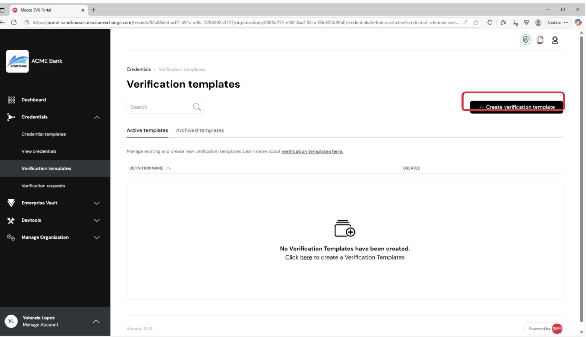
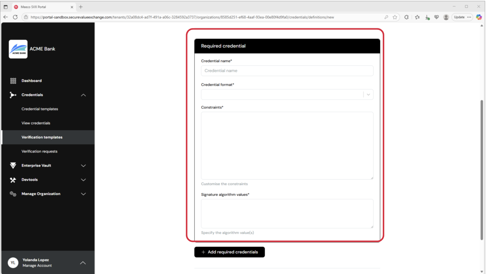
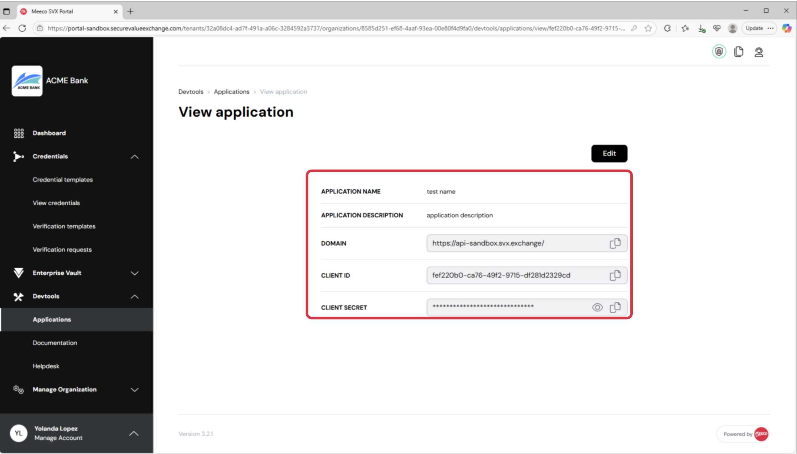

# CATRINA Identity Integration Guide

This guide outlines the process for integrating with the CATRINA Identity Platform. This document is still a work in progress and may contain errors, please reach out to Meeco for any help that you may require.


- [1. Overview](#1-overview)
- [2. Pre-requisites](#2-pre-requisites)
  - [2.1. Organisation Creation](#21-organisation-creation)
  - [2.2. Authentication (Applications)](#22-authentication-applications)
  - [2.3. Verification Template](#23-verification-template)
  - [2.4. CATRINA-Side Integration Setup](#24-catrina-side-integration-setup)
  - [2.5. Integrator-Side Setup](#25-integrator-side-setup)
- [3. Integration and Authentication](#3-integration-and-authentication)
  - [3.1 Overview of Identity Verification with CATRINA](#31-overview-of-identity-verification-with-catrina)
  - [3.2. Authentication](#32-authentication)
  - [3.3. Creating a Session](#33-creating-a-session)
  - [3.4. Retrieving a Session](#34-retrieving-a-session)
  - [3.5.Best Practices](#35best-practices)
- [Appendix 1: Verification Template Constraints Example](#appendix-1-verification-template-constraints-example)
- [Appendix 2: Available Attributes](#appendix-2-available-attributes)
- [Appendix 3: Integration Example Using JavaScript](#appendix-3-integration-example-using-javascript)
  - [Add a button to your website (client-side)](#add-a-button-to-your-website-client-side)
  - [Redirect to CATRINA Identity (client-side, server-side)](#redirect-to-catrina-identity-client-side-server-side)
  - [Access Verification Results](#access-verification-results)

## 1. Overview

The CATRINA Identity Platform is designed for seamless integration, giving organizations full control over their identity verification workflows. Integration begins in the Portal, where administrators can configure key parameters — such as the user data required for a specific use case (e.g., name, date of birth, address, or government-issued ID) — and specify the purpose for requesting this data.

Once configured, developers can use our standards-based REST API to initiate a secure data request session, retrieve a unique session URL, and monitor the transaction status in real time. To keep the integration lightweight and system-agnostic, the only client-side task is redirecting users to the CATRINA-hosted experience — typically via a button or link.

When a user is redirected, CATRINA handles the entire identity verification process — including consent, data sharing, error handling, and secure transaction completion. The hosted environment adheres to privacy-by-design and security-by-design principles and complies with standards such as GDPR, eIDAS, and ISO/IEC 27001 — so integrators don’t have to.

After verification, users are redirected back to your website or app. Verified identity attributes can be retrieved via the API or viewed in the dashboard. This approach combines the flexibility of an API-first model with the simplicity of a no-SDK, hosted solution. CATRINA is language-agnostic and compatible with any frontend framework, enabling integration into any environment without additional libraries or technical constraints.

## 2. Pre-requisites

This section covers all the components that need to be set up before you can begin your CATRINA Identity integration.

### 2.1. Organisation Creation

An Organisation must be created to successfully deploy your CATRINA identity integration. Organisations act as Issuers and Verifiers within the CATRINA Platform. For this integration, you'll need an organisation that acts as a Verifier.

Organisations are created by Tenant Administrators. If you are not a Tenant Administrator, please contact your CATRINA Identity account manager or raise a request at the DNP Service Desk.

Once your Organisation is created, you'll get an email invitation to join the Portal as an Administrator. Follow the instructions in the email to complete your onboarding and Organisation setup.

### 2.2. Authentication (Applications)

To enable your integration, you need to set up two applications in the Portal. One application will host the CATRINA Identity application, and the other will be used to authenticate and connect to it.

**CATRINA Identity Hosting Application**

1.  Navigate to the "Devtools" tab in the side menu and select "Applications".
2.  Create an application with a suitable name and description, for example:
    - **Name:** "CATRINA Identity Host"
    - **Description:** "Used for the CATRINA Identity Platform"

**CATRINA Identity Authentication Application**

1.  Navigate to the "Devtools" tab and select "Applications".
2.  Create an application with a suitable name and description, for example:
    - **Name:** "CATRINA Identity Authentication"
    - **Description:** "Used for the CATRINA Identity Platform"
3.  After your CATRINA Identity Account Manager completes the setup, you can use the `client_id` and `client_secret` to securely connect to your CATRINA Identity deployment.

### 2.3. Verification Template

Next, set up a Verification Template for your use case. This template is used to request specific information from your users.

1.  In the Portal, go to the "Verification templates" tab in the navigation menu.


2.  Click the "Create verification template" button.

 3. Enter a template name and purpose. For example: - **Name:** "Guest Identity Verification" - **Purpose:** "To verify guest identity information using the CATRINA Identity Platform"


4.  Complete the "Required credential" section:
    - **Credential name:** Guest Identity
    - **Credential format:** Select `dc+sd-jwt`.
    - **Constraints:** This section is automatically populated. For account-based solutions, only specific attributes can be requested.
    - **Signature algorithm value:** This will be automatically populated. Leave it as is.

 5. Click "Create".

 6. Once created, click the ellipsis icon (...) and select "View" to get the `presentation_template_id`. You will need this for the session payload.

> **Note:** Despite the option to add multiple credentials via “Add required credentials”, the CATRINA Identity platform currently only supports one required credential per Verification Template. Please leave this as a single credential.

> **Note:** For account-based integrations, only specific credential attributes can be used when defining the credential “constraints”. See Appendix 2 for details.

### 2.4. CATRINA-Side Integration Setup

After completing these steps, contact your CATRINA Identity Account Manager and provide the following information:

- The `client_id` of your CATRINA Identity Hosting Application
- The `client_id` of your CATRINA Identity Authentication Application
- The ID of your presentation template

Once this information is received, the CATRINA Identity Account Manager will complete the necessary configuration on their side. Please wait for confirmation from your CATRINA Identity Account Manager before proceeding with the integrator-side setup.

### 2.5. Integrator-Side Setup

To continue with the integration, ensure you have the following configuration information:

- The `client_id` of your CATRINA Identity Authentication Application
- The `client_secret` of your CATRINA Identity Authentication Application
- The ID of your presentation template
- CATRINA API  login URL
- CATRINA Identity API host

The first three tokens are linked to the entities you created in the Portal.
If you haven’t received the CATRINA API login URL and Identity API host, please request them from your CATRINA Identity Account Manager.


## 3. Integration and Authentication

### 3.1 Overview of Identity Verification with CATRINA

Identity Verification with CATRINA consists of the following steps:

1. The user initiates an identity verification session by clicking a button or link on your website or mobile application.
2. Your backend authenticates with CATRINA Identity as the Identity Authentication Application and retrieves an access token.
3. Your backend calls the CATRINA Identity API to create an identity verification session. One of the input parameters in this call is a return URL — where the user should be redirected after the verification is complete. The response includes a session ID and a redirect URL.
4. The user’s browser is redirected to the CATRINA-hosted experience using the redirect URL.
5. The user completes the verification process by interacting with CATRINA and one of its supported identity providers.
6. Upon completion, the user’s browser is redirected back to your website via the return URL specified in step 3.
7. Your backend checks the status of the identity verification session to confirm the result.

The steps above are illustrated in the following sequence diagram:

```mermaid
sequenceDiagram

    participant YW as Your Website Page
    participant YB as Your Backend

    participant CAPI as CATRINA API
    participant CW as CATRINA Website

    YW ->>+ YB: "Verify" button clicked

    YB ->>+ CAPI: Login with client ID<br>and client secret
    CAPI -->>- YB: Access token

    YB ->>+ CAPI: Create verification session<br>with template ID and access token
    CAPI -->>- YB: verification session ID and redirect URL

    YB -->>- YW: URL to redirect to VS

    YW->>+CW: User is redirected to CATRINA Website

    CW->>+CW: User completes verification

    CW->>+YW: User is redirected to the SUCCESS URL

    YB ->>+ CAPI: Retrieve verification results<br>with verification token ID and access token
    CAPI -->>- YB: verification status, verified data
```

<!-- Gitbook requires mermaid integration https://www.gitbook.com/integrations/mermaid -->

To implement this solution, your backend will need to perform three server-to-server (backend-to-backend) calls:

1. Authentication — an HTTP POST request  following the OAuth 2.0 client credentials grant flow
2. Creating a Session — a call to initiate an identity verification session
3. Retrieving a Session — a call to check the session status and access the verified identity data

The following sections provide a detailed look at each call, using the curl command-line utility to demonstrate the requests.

### 3.2. Authentication

To interact with your CATRINA Identity integration, you'll need the `client_id` and `client_secret` from the "CATRINA Identity Authentication Application". This information is in the application's details in the Portal.



You will also need the CATRINA API login URL (see [2.5. Integrator-Side Setup](#25-integrator-side-setup)).

The authentication call will look as follows:

```bash
curl -X POST \
  "https://CATRINA_API_LOGIN_URL" \
  -H "Content-Type: application/x-www-form-urlencoded" \
  -d "grant_type=client_credentials" \
  -d "client_id=YOUR_CLIENT_ID" \
  -d "client_secret=YOUR_CLIENT_SECRET"
```

This returns your access token:

```json
{
  "access_token": "ACCESS_TOKEN",
  "expires_in": 600,
  "token_type": "Bearer"
}
```

Your backend is required to use this  access token as a Bearer token in the Authorization header for all API calls to your CATRINA Identity deployment.

### 3.3. Creating a Session

To create a session, you’ll need the following parameters:

- `presentation_template_id`: The ID of your presentation template
- `success_url`: The URL on your website where the user will be redirected after successful verification.
- `return_url`: The URL on your website where the user will be redirected if the flow is canceled or an error occurs.

Create the session by making the following API call:

```bash
curl -X POST "https://YOUR_CATRINA_IDENTITY_URL/identity/sessions" \
  -H "Authorization: Bearer YOUR_ACCESS_TOKEN" \
  -H 'Content-Type: application/json' \
  -d '{ "presentation_template_id": "YOUR_PRESENTATION_TEMPLATE_ID", "success_url": "https://your-website.com/success", "return_url": "https://your-website.com/return" }'
```

The response payload will contain the following information:

```json
{
  "id": "XXX-XXX-XXX-XXX",
  "url": "https://REDIRECT_URL"
}
```

Save the session `id` for future reference. The `url` shoulf be used to to redirect the user to the CATRINA Identity website.

### 3.4. Retrieving a Session

Once a session is complete, you can get the verification results from the `verified_claims` object in the session response.

Use the session ID from the previous call to retrieve the data:

```bash
curl -X GET 'https://YOUR_CATRINA_IDENTITY_URL/identity/sessions/SESSION_ID' \
  -H "Authorization: Bearer YOUR_ACCESS_TOKEN"
```

The response payload will contain the following information:

```json
{
  "session_id": "session_id",
  "status": "verified",
  "verified_claims": {
    "given_name_unicode": "Alice",
    "family_name_unicode": "Wong",
    "birth_date": "1993-06-15",
    "document_number": "ABC123456",
    "issuing_country": "JP",
    "expiry_date": "2030-01-01",
    "portrait": "data:image/jpeg;base64,...",
    "resident_address_unicode": "1-2-3 Shibuya, Tokyo",
    "age_over_18": true,
    "phone_number": "+819012345678",
    "email": "alice@example.com"
  },
  "error": "Error if exists",
  "error_description": "Error description if exists"
}
```


### 3.5.Best Practices

- Minimize data usage: Only request, process, and store the identity attributes essential for your use case. Avoid collecting unnecessary personal information.
- Protect sensitive data: Always use secure, encrypted channels (e.g., HTTPS) for data transmission. Store data securely and in compliance with relevant regulations.
- Control and audit access: Restrict access to identity data to authorized services and personnel only. Implement logging and regular audits to monitor who accesses the data and when.


## Appendix 1: Verification Template Constraints Example

Replace `"const": "PhotoID_wContact_INV"` with the Credential Type you are verifying against. Confirm this with your Meeco Account Manager.

```json
{
  "limit_disclosure": "preferred",
  "fields": [
    {
      "path": ["$.vct"],
      "filter": {
        "type": "string",
        "const": "PhotoID_wContact_INV"
      }
    },
    { "path": ["$.given_name_unicode"] },
    { "path": ["$.family_name_unicode"] },
    { "path": ["$.birth_date"] },
    { "path": ["$.phone_number"], "optional": true },
    { "path": ["$.email"], "optional": true },
    { "path": ["$.resident_address_unicode"], "optional": true },
    { "path": ["$.resident_city_unicode"], "optional": true },
    { "path": ["$.resident_state"], "optional": true },
    { "path": ["$.resident_postal_code"], "optional": true },
    { "path": ["$.resident_country"], "optional": true },
    { "path": ["$.nationality"], "optional": true }
  ]
}
```

---

## Appendix 2: Available Attributes

These are the available attributes from account-based integration partners.
| Field | Description | Connect ID | Select ID |
| :--- | :--- | :---: | :---: |
| **given_name_unicode** | First name of the holder, in Unicode. | ✅ | ✅ |
| **family_name_unicode** | Last name of the holder, in Unicode. | ✅ | ✅ |
| **birth_date** | ISO 8601 date of birth. | ✅ | ✅ |
| **document_number** | Document or passport number. | ❌ | ✅ |
| **issuing_country** | Country code of issuing authority. | ❌ | ✅ |
| **expiry_date** | Document expiry date. | ❌ | ✅ |
| **portrait** | Base64-encoded portrait image. | ❌ | ✅ |
| **resident_address_unicode** | Full address in Unicode. | ✅ | ✅ |
| **age_over_18** | Boolean indicating age eligibility. | ✅ | ❌ |
| **phone_number** | Phone number if collected. | ✅ | ✅ |
| **email** | Email address if provided. | ✅ | ✅ |

## Appendix 3: Integration Example Using JavaScript


This section provides a JavaScript example of integrating with CATRINA.

### Add a button to your website (client-side)

```html
<html>
  <head>
    <title>Verify your identity</title>
  </head>
  <body>
    <button id="verify-button">Verify</button>
  </body>
</html>
```

### Redirect to CATRINA Identity (client-side, server-side)

When the button is clicked, redirect the user to a CATRINA Identity hosted page.

**Set up an endpoint to create a Verify Session**
On the server-side, create a `create-verification-session` endpoint (HTTP POST) that authenticates, creates a session, and returns the session URL.

> **Note:** To retrieve an access token, this code uses an OAuth2 library —  but don’t let that intimidate you, the OAuth2 client credentials grant is just a straightforward HTTP POST request. You can see how it works in the Authentication section, where we show a plain HTTP example.


```javascript
const axios = require("axios");
const { ClientCredentials } = require("simple-oauth2");

const config = {
  client: {
    id: "your_client_id",
    secret: "your_client_secret",
  },
  auth: {
    tokenHost: "https://login.stg.svxawsjp.meeco.cloud",
    tokenPath: "/oauth2/token",
  },
};

const api = axios.create({
  baseURL: "https://ocw-kaze-no-hana-inv.catrina-identity.stg-diw.net",
  headers: { "Content-Type": "application/json" },
});

async function createVerificationSession(presentationTemplateId) {
  const client = new ClientCredentials(config);
  const token = await client.getToken();
  const res = await api.post(
    "/identity/sessions",
    {
      presentation_template_id: presentationTemplateId,
      success_url: "https://your-website.com/success",
      return_url:  "https://your-website.com/return",
    },
    {
      headers: { Authorization: `Bearer ${token.token.access_token}` },
    }
  );
  return res.data.url;
}

// Usage
const url = await createVerificationSession("template-abc");
```

**Add an event handler**

> **Note:** Always create sessions on the server-side to protect your authentication keys.

```html
<html>
  <head>
    <title>Verify your identity</title>
  </head>
  <body>
    <button id="verify-button">Verify</button>
    <script type="text/javascript">
      var verifyButton = document.getElementById("verify-button");
      verifyButton.addEventListener("click", function () {
        fetch("/create-verification-session", {
          method: "POST",
        })
          .then(function (response) {
            return response.json();
          })
          .then(function (session) {
            window.location.href = session.url;
          })
          .catch(function (error) {
            console.error("Error:", error);
          });
      });
    </script>
  </body>
</html>
```

### Access Verification Results

After a session is completed, access the structured verification results via the session response in the `verified_claims` object.

**Set up an endpoint to access a session's results**
On the server-side, create a `get-verification-session` endpoint (HTTP GET) to fetch session data.

```javascript
async function getVerificationSession(sessionId) {
  const client = new ClientCredentials(config);
  const token = await client.getToken();
  const res = await api.get(`/identity/sessions/${sessionId}`, {
    headers: { Authorization: `Bearer ${token.token.access_token}` },
  });
  return res.data;
}

// Usage
const sessionDetails = await getVerificationSession(sessionId);
```

**Example Response:**

```json
{
  "session_id": "sess_1234567890",
  "status": "verified",
  "verified_claims": {
    "given_name_unicode": "Alice",
    "family_name_unicode": "Wong",
    "birth_date": "1993-06-15",
    "document_number": "ABC123456",
    "issuing_country": "JP",
    "expiry_date": "2030-01-01",
    "portrait": "data:image/jpeg;base64,...",
    "resident_address_unicode": "1-2-3 Shibuya, Tokyo",
    "age_over_18": true,
    "phone_number": "+819012345678",
    "email": "alice@example.com"
  }
}
```

By following these steps, you should have successfully integrated your system with the CATRINA Identity platform.
