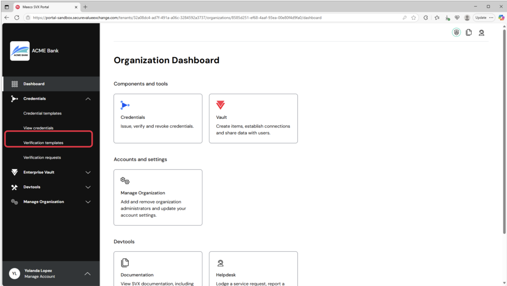
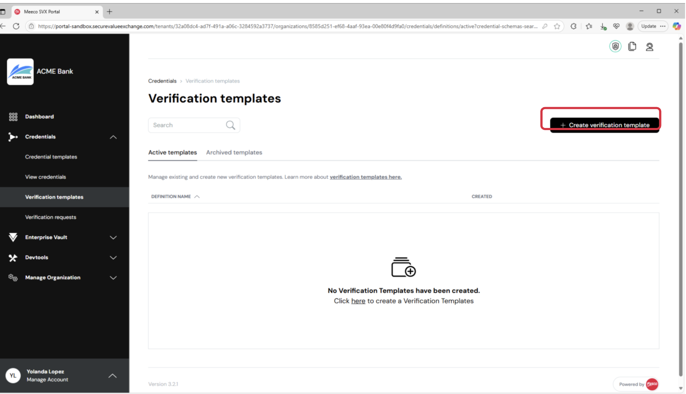
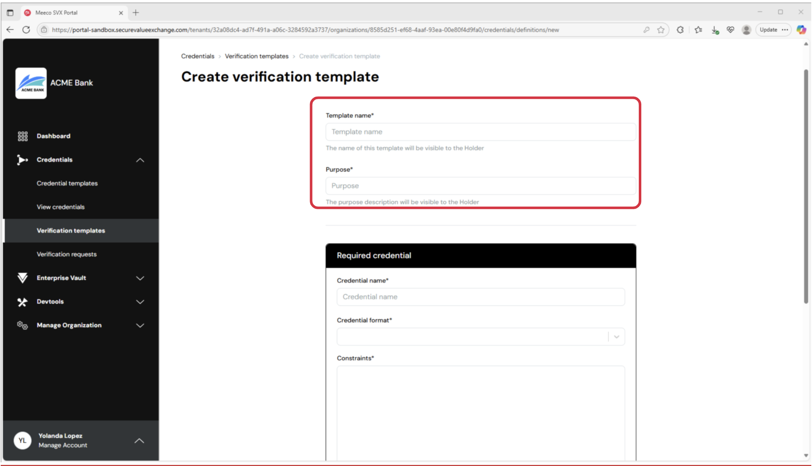
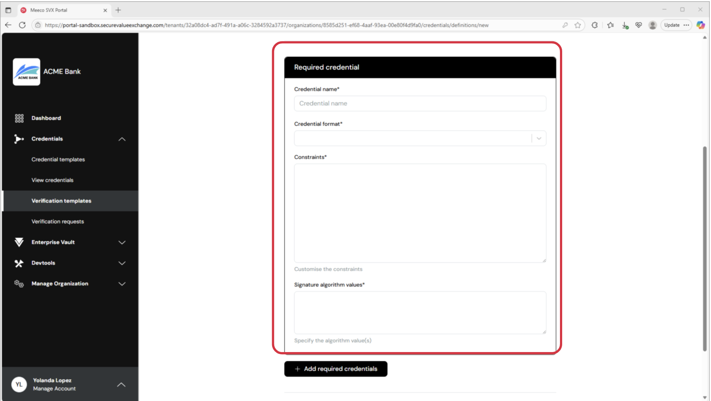
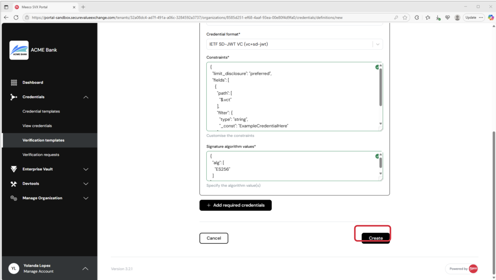
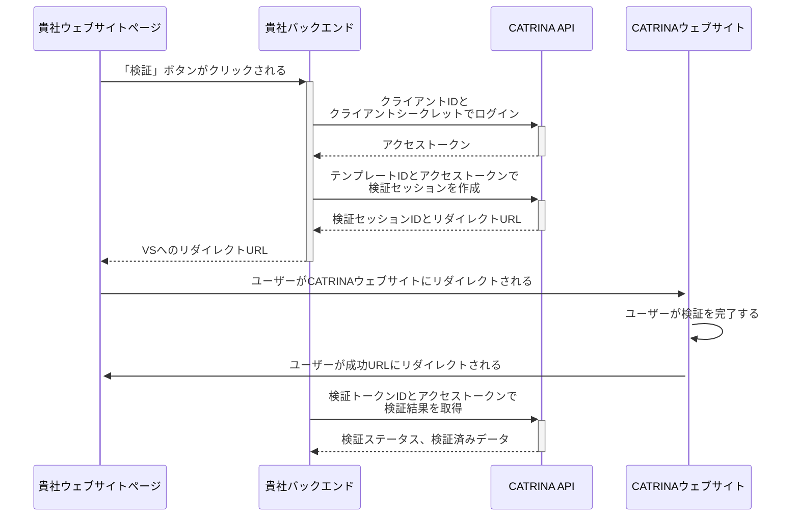
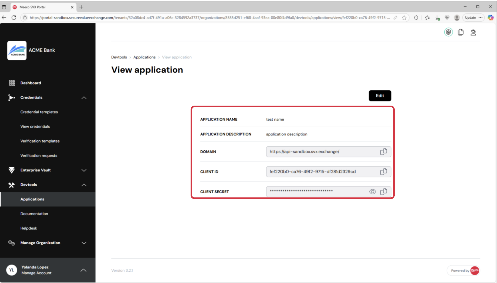

# CATRINA Identity 統合ガイド

このガイドは、CATRINA Identity Platform との統合プロセスについて概説します。このドキュメントは現在作成中であり、誤りが含まれている可能性があります。サポートが必要な場合は、Meeco までお問い合わせください。

- [CATRINA Identity 統合ガイド](#catrina-identity-統合ガイド)
  - [1. 概要](#1-概要)
  - [2. 前提条件](#2-前提条件)
    - [2.1. 組織の作成](#21-組織の作成)
    - [2.2. 認証 (アプリケーション)](#22-認証-アプリケーション)
    - [2.3. 検証テンプレート](#23-検証テンプレート)
    - [2.4. CATRINA 側の統合設定](#24-catrina-側の統合設定)
    - [2.5. 統合担当者側の設定](#25-統合担当者側の設定)
  - [3. 統合と認証](#3-統合と認証)
    - [3.1. CATRINA による本人確認の概要](#31-catrina-による本人確認の概要)
  - [3.2. 認証](#32-認証)
  - [3.3. セッションの作成](#33-セッションの作成)
  - [3.4. セッションの取得](#34-セッションの取得)
  - [3.5. ベストプラクティス](#35-ベストプラクティス)
  - [付録 1：検証テンプレートの制約（Constraints）の例](#付録-1検証テンプレートの制約constraintsの例)
  - [付録 2：利用可能な属性](#付録-2利用可能な属性)
  - [付録 3：JavaScript を使用した統合例](#付録-3javascript-を使用した統合例)
    - [ウェブサイトにボタンを追加する (クライアントサイド)](#ウェブサイトにボタンを追加する-クライアントサイド)
    - [CATRINA Identity へリダイレクトする (クライアントサイド、サーバーサイド)](#catrina-identity-へリダイレクトする-クライアントサイドサーバーサイド)
    - [検証結果へのアクセス](#検証結果へのアクセス)

## 1. 概要

CATRINA Identity Platform は、シームレスな統合を実現するために設計されており、組織が本人確認のワークフローを完全に制御できるようにします。統合はポータルから始まり、管理者は特定のユースケースに必要なユーザーデータ（例：氏名、生年月日、住所、政府発行 ID）やデータ要求の目的などの主要なパラメータを設定できます。

設定が完了すると、開発者は標準ベースの REST API を使用して、安全なデータ要求セッションを開始し、一意のセッション URL を取得し、トランザクションのステータスをリアルタイムで監視できます。統合を軽量かつシステムに依存しないようにするため、クライアントサイドのタスクは、通常ボタンやリンクを介してユーザーを CATRINA がホストする体験へリダイレクトすることだけです。

ユーザーがリダイレクトされると、CATRINA が同意、データ共有、エラーハンドリング、安全なトランザクション完了を含む本人確認プロセス全体を処理します。ホスト環境は、プライバシーバイデザインおよびセキュリティバイデザインの原則に準拠し、GDPR、eIDAS、ISO/IEC 27001 などの標準に準拠しているため、統合担当者がこれらを気にする必要はありません。

検証後、ユーザーは貴社のウェブサイトやアプリにリダイレクトされます。検証済みの本人確認属性は、API 経由で取得するか、ダッシュボードで確認できます。このアプローチは、API ファーストモデルの柔軟性と、SDK 不要のホスト型ソリューションのシンプルさを兼ね備えています。CATRINA は言語に依存せず、あらゆるフロントエンドフレームワークと互換性があり、追加のライブラリや技術的な制約なしに、どのような環境へも統合が可能です。

## 2. 前提条件

このセクションでは、CATRINA Identity の統合を開始する前に設定が必要なすべてのコンポーネントについて説明します。

### 2.1. 組織の作成

CATRINA Identity 統合を正常に展開するには、**組織**を作成する必要があります。組織は、CATRINA Platform 内で発行者 (Issuer) および検証者 (Verifier)として機能します。この統合では、**検証者 (Verifier)** として機能する組織が必要です。

組織はテナント管理者によって作成されます。テナント管理者でない場合は、CATRINA Identity のアカウントマネージャーに連絡するか、DNP サービスデスクにリクエストを提出してください。

組織が作成されると、管理者としてポータルに参加するための招待メールが届きます。メールの指示に従って、オンボーディングと組織の設定を完了してください。

### 2.2. 認証 (アプリケーション)

統合を有効にするには、ポータルで 2 つのアプリケーションを設定する必要があります。1 つのアプリケーションは CATRINA Identity アプリケーションをホストし、もう 1 つはそれに認証・接続するために使用されます。

**CATRINA Identity ホスティングアプリケーション**

1.  サイドメニューの「Devtools」タブに移動し、「Applications」を選択します。
2.  適切な名前と説明を持つアプリケーションを作成します。例：
    - **Name:** "CATRINA Identity Host"
    - **Description:** "Used for the CATRINA Identity Platform"

**CATRINA Identity 認証アプリケーション**

1.  「Devtools」タブに移動し、「Applications」を選択します。
2.  適切な名前と説明を持つアプリケーションを作成します。例：
    - **Name:** "CATRINA Identity Authentication"
    - **Description:** "Used for the CATRINA Identity Platform"
3.  CATRINA Identity のアカウントマネージャーが設定を完了した後、`client_id`と`client_secret`を使用して CATRINA Identity のデプロイメントに安全に接続できます。

### 2.3. 検証テンプレート

次に、ユースケースに合わせた**検証テンプレート**を設定します。このテンプレートは、ユーザーから特定の情報を要求するために使用されます。

1.  ポータルで、ナビゲーションメニューの「Verification templates」タブに移動します。



2.  「Create verification template」ボタンをクリックします。



3. テンプレート名と目的を入力します。例：
   - **Name:** "Guest Identity Verification"
   - **Purpose:** "To verify guest identity information using the CATRINA Identity Platform"



4.  「Required credential」セクションを完成させます：
    - **Credential name:** Guest Identity
    - **Credential format:** `dc+sd-jwt`を選択します。
    - **Constraints:** このセクションは自動的に入力されます。アカウントベースのソリューションでは、特定の属性のみが要求可能です。
    - **Signature algorithm value:** これは自動的に入力されます。そのままにしてください。



5. 「Create」をクリックします。



6. 作成後、省略記号アイコン（...）をクリックし、「View」を選択して`presentation_template_id`を取得します。これはセッションのペイロードに必要になります。

> **注記:** 「Add required credentials」を介して複数のクレデンシャルを追加するオプションがありますが、CATRINA Identity プラットフォームは現在、検証テンプレートごとに 1 つの必須クレデンシャルのみをサポートしています。ここは単一のクレデンシャルのままにしてください。

> **注記:** アカウントベースの統合の場合、クレデンシャルの「制約（constraints）」を定義する際に使用できるのは特定のクレデンシャル属性のみです。詳細は付録 2 を参照してください。

### 2.4. CATRINA 側の統合設定

これらの手順を完了したら、CATRINA Identity のアカウントマネージャーに連絡し、以下の情報を提供してください：

- CATRINA Identity ホスティングアプリケーションの`client_id`
- CATRINA Identity 認証アプリケーションの`client_id`
- プレゼンテーションテンプレートの ID

この情報を受け取った後、CATRINA Identity のアカウントマネージャーが必要な設定を CATRINA 側で完了させます。統合担当者側の設定に進む前に、CATRINA Identity のアカウントマネージャーからの確認をお待ちください。

### 2.5. 統合担当者側の設定

統合を続けるには、以下の設定情報があることを確認してください：

- CATRINA Identity 認証アプリケーションの`client_id`
- CATRINA Identity 認証アプリケーションの`client_secret`
- プレゼンテーションテンプレートの ID
- CATRINA API ログイン URL
- CATRINA Identity API ホスト

最初の 3 つのトークンは、ポータルで作成したエンティティにリンクされています。
CATRINA API ログイン URL と Identity API ホストを受け取っていない場合は、CATRINA Identity のアカウントマネージャーにリクエストしてください。

## 3. 統合と認証

### 3.1. CATRINA による本人確認の概要

CATRINA による本人確認は、以下のステップで構成されます：

1. ユーザーが貴社のウェブサイトまたはモバイルアプリケーションのボタンやリンクをクリックして、本人確認セッションを開始します。
2. 貴社のバックエンドが Identity Authentication Application として CATRINA Identity に認証し、アクセストークンを取得します。
3. 貴社のバックエンドが CATRINA Identity API を呼び出して、本人確認セッションを作成します。この呼び出しの入力パラメータの 1 つは、検証完了後にユーザーがリダイレクトされるべき戻り URL です。レスポンスにはセッション ID とリダイレクト URL が含まれます。
4. ユーザーのブラウザは、リダイレクト URL を使用して CATRINA がホストする体験にリダイレクトされます。
5. ユーザーは、CATRINA およびサポートされている ID プロバイダーと対話して、検証プロセスを完了します。
6. 完了すると、ユーザーのブラウザはステップ 3 で指定された戻り URL を介して貴社のウェブサイトにリダイレクトされます。
7. 貴社のバックエンドが本人確認セッションのステータスを確認し、結果を確定します。

上記のステップは、以下のシーケンス図で示されています：



このソリューションを実装するには、貴社のバックエンドが 3 つのサーバー間（バックエンド間）呼び出しを実行する必要があります：

1.  **認証** — OAuth 2.0 クライアントクレデンシャルグラントフローに従った HTTP POST リクエスト
2.  **セッションの作成** — 本人確認セッションを開始するための呼び出し
3.  **セッションの取得** — セッションステータスを確認し、検証済み本人確認データにアクセスするための呼び出し

以下のセクションでは、`curl`コマンドラインユーティリティを使用してリクエストを示しながら、各呼び出しを詳しく見ていきます。

## 3.2. 認証

CATRINA Identity 統合と対話するには、「CATRINA Identity Authentication Application」からの`client_id`と`client_secret`が必要です。この情報は、ポータル内のアプリケーション詳細にあります。



また、CATRINA API ログイン URL も必要です（[2.5. 統合担当者側の設定](#25-統合担当者側の設定)を参照）。

認証呼び出しは次のようになります：

```bash
curl -X POST \
  "https://CATRINA_API_LOGIN_URL" \
  -H "Content-Type: application/x-www-form-urlencoded" \
  -d "grant_type=client_credentials" \
  -d "client_id=YOUR_CLIENT_ID" \
  -d "client_secret=YOUR_CLIENT_SECRET"
```

これにより、アクセストークンが返されます：

```json
{
  "access_token": "ACCESS_TOKEN",
  "expires_in": 600,
  "token_type": "Bearer"
}
```

貴社のバックエンドは、CATRINA Identity デプロイメントへのすべての API 呼び出しで、このアクセストークンを Authorization ヘッダーの Bearer トークンとして使用する必要があります。

## 3.3. セッションの作成

セッションを作成するには、次のパラメータが必要です：

- `presentation_template_id`: プレゼンテーションテンプレートの ID
- `success_url`: 検証成功後にユーザーがリダイレクトされる貴社ウェブサイトの URL
- `return_url`: フローがキャンセルされたりエラーが発生した場合にユーザーがリダイレクトされる貴社ウェブサイトの URL

次の API 呼び出しを行ってセッションを作成します：

```curl
curl -X POST "https://YOUR_CATRINA_IDENTITY_URL/identity/sessions" \
 -H "Authorization: Bearer YOUR_ACCESS_TOKEN" \
 -H 'Content-Type: application/json' \
 -d '{ "presentation_template_id": "YOUR_PRESENTATION_TEMPLATE_ID", "success_url": "https://your-website.com/success", "return_url": "https://your-website.com/return" }'
```

レスポンスペイロードには次の情報が含まれます：

```json
{
  "id": "XXX-XXX-XXX-XXX",
  "url": "https://REDIRECT_URL"
}
```

セッションの`id`を後で使用するために保存してください。`url`はユーザーを CATRINA Identity ウェブサイトにリダイレクトするために使用されるべきです。

## 3.4. セッションの取得

セッションが完了したら、セッションレスポンスの`verified_claims`オブジェクトから検証結果を取得できます。

前の呼び出しで取得したセッション ID を使用してデータを取得します：

```curl
curl -X GET 'https://YOUR_CATRINA_IDENTITY_URL/identity/sessions/SESSION_ID' \
-H "Authorization: Bearer YOUR_ACCESS_TOKEN"
```

レスポンスペイロードには次の情報が含まれます：

```json
{
  "session_id": "session_id",
  "status": "verified",
  "verified_claims": {
    "given_name_unicode": "Alice",
    "family_name_unicode": "Wong",
    "birth_date": "1993-06-15",
    "document_number": "ABC123456",
    "issuing_country": "JP",
    "expiry_date": "2030-01-01",
    "portrait": "data:image/jpeg;base64,...",
    "resident_address_unicode": "1-2-3 Shibuya, Tokyo",
    "age_over_18": true,
    "phone_number": "+819012345678",
    "email": "alice@example.com"
  },
  "error": "Error if exists",
  "error_description": "Error description if exists"
}
```

## 3.5. ベストプラクティス

- **データ使用の最小化:** ユースケースに不可欠な本人確認属性のみを要求、処理、保存してください。不要な個人情報の収集は避けてください。
- **機密データの保護:** データ送信には常に安全な暗号化チャネル（例：HTTPS）を使用してください。データは安全に、関連する規制に準拠して保管してください。
- **アクセスの制御と監査:** 本人確認データへのアクセスを、承認されたサービスと担当者のみに制限してください。誰がいつデータにアクセスしたかを監視するために、ロギングと定期的な監査を実装してください。

## 付録 1：検証テンプレートの制約（Constraints）の例

`"const": "PhotoID_wContact_INV"`を、検証対象のクレデンシャルタイプに置き換えてください。これは Meeco のアカウントマネージャーに確認してください。

```json
{
  "limit_disclosure": "preferred",
  "fields": [
    {
      "path": ["$.vct"],
      "filter": {
        "type": "string",
        "const": "PhotoID_wContact_INV"
      }
    },
    { "path": ["$.given_name_unicode"] },
    { "path": ["$.family_name_unicode"] },
    { "path": ["$.birth_date"] },
    { "path": ["$.phone_number"], "optional": true },
    { "path": ["$.email"], "optional": true },
    { "path": ["$.resident_address_unicode"], "optional": true },
    { "path": ["$.resident_city_unicode"], "optional": true },
    { "path": ["$.resident_state"], "optional": true },
    { "path": ["$.resident_postal_code"], "optional": true },
    { "path": ["$.resident_country"], "optional": true },
    { "path": ["$.nationality"], "optional": true }
  ]
}
```

## 付録 2：利用可能な属性

これらは、アカウントベースの統合パートナーから利用可能な属性です。

| フィールド                   | 説明                              | Connect ID | Select ID |
| :--------------------------- | :-------------------------------- | :--------: | :-------: |
| **given_name_unicode**       | 保有者の名（Unicode）             |     ✅     |    ✅     |
| **family_name_unicode**      | 保有者の姓（Unicode）             |     ✅     |    ✅     |
| **birth_date**               | 生年月日（ISO 8601）              |     ✅     |    ✅     |
| **document_number**          | 書類またはパスポート番号          |     ❌     |    ✅     |
| **issuing_country**          | 発行機関の国コード                |     ❌     |    ✅     |
| **expiry_date**              | 書類の有効期限                    |     ❌     |    ✅     |
| **portrait**                 | Base64 エンコードされた顔写真画像 |     ❌     |    ✅     |
| **resident_address_unicode** | 住所（Unicode）                   |     ✅     |    ✅     |
| **age_over_18**              | 18 歳以上かどうかを示すブール値   |     ✅     |    ❌     |
| **phone_number**             | 収集された場合の電話番号          |     ✅     |    ✅     |
| **email**                    | 提供された場合の E メールアドレス |     ✅     |    ✅     |

## 付録 3：JavaScript を使用した統合例

このセクションでは、CATRINA と統合するための JavaScript の例を提供します。

### ウェブサイトにボタンを追加する (クライアントサイド)

```hmtl

<html>
  <head>
    <title>Verify your identity</title>
  </head>
  <body>
    <button id="verify-button">Verify</button>
  </body>
</html>
```

### CATRINA Identity へリダイレクトする (クライアントサイド、サーバーサイド)

ボタンがクリックされたら、ユーザーを CATRINA Identity がホストするページにリダイレクトします。

**検証セッションを作成するエンドポイントを設定する**
サーバーサイドで、認証、セッション作成、セッション URL の返却を行う`create-verification-session`エンドポイント（HTTP POST）を作成します。

> **注記:** このコードではアクセストークンを取得するために OAuth2 ライブラリを使用していますが、難しく考える必要はありません。OAuth2 クライアントクレデンシャルグラントは、単純な HTTP POST リクエストです。認証セクションで示したプレーンな HTTP の例でその仕組みを確認できます。

```javascript
const axios = require("axios");
const { ClientCredentials } = require("simple-oauth2");

const config = {
  client: {
    id: "your_client_id",
    secret: "your_client_secret",
  },
  auth: {
    tokenHost: "https://login.stg.svxawsjp.meeco.cloud",
    tokenPath: "/oauth2/token",
  },
};

const api = axios.create({
  baseURL: "https://ocw-kaze-no-hana-inv.catrina-identity.stg-diw.net",
  headers: { "Content-Type": "application/json" },
});

async function createVerificationSession(presentationTemplateId) {
  const client = new ClientCredentials(config);
  const token = await client.getToken();
  const res = await api.post(
    "/identity/sessions",
    {
      presentation_template_id: presentationTemplateId,
      success_url: "https://your-website.com/success",
      return_url: "https://your-website.com/return",
    },
    {
      headers: { Authorization: `Bearer ${token.token.access_token}` },
    }
  );
  return res.data.url;
}

// 使用例
const url = await createVerificationSession("template-abc");
```

**イベントハンドラを追加する**

> **注記:** 認証キーを保護するため、セッションは常にサーバーサイドで作成してください。

```html
<html>
  <head>
    <title>Verify your identity</title>
  </head>
  <body>
    <button id="verify-button">Verify</button>
    <script type="text/javascript">
      var verifyButton = document.getElementById("verify-button");
      verifyButton.addEventListener("click", function () {
        fetch("/create-verification-session", {
          method: "POST",
        })
          .then(function (response) {
            return response.json();
          })
          .then(function (session) {
            window.location.href = session.url;
          })
          .catch(function (error) {
            console.error("Error:", error);
          });
      });
    </script>
  </body>
</html>
```

### 検証結果へのアクセス

セッションが完了した後、`verified_claims`オブジェクト内のセッションレスポンスを介して、構造化された検証結果にアクセスします。

**セッション結果にアクセスするエンドポイントを設定する**
サーバーサイドで、セッションデータを取得するための`get-verification-session`エンドポイント（HTTP GET）を作成します。

```javascript
async function getVerificationSession(sessionId) {
  const client = new ClientCredentials(config);
  const token = await client.getToken();
  const res = await api.get(`/identity/sessions/${sessionId}`, {
    headers: { Authorization: `Bearer ${token.token.access_token}` },
  });
  return res.data;
}

// 使用例
const sessionDetails = await getVerificationSession(sessionId);
```

**レスポンス例:**

```json
{
  "session_id": "sess_1234567890",
  "status": "verified",
  "verified_claims": {
    "given_name_unicode": "Alice",
    "family_name_unicode": "Wong",
    "birth_date": "1993-06-15",
    "document_number": "ABC123456",
    "issuing_country": "JP",
    "expiry_date": "2030-01-01",
    "portrait": "data:image/jpeg;base64,...",
    "resident_address_unicode": "1-2-3 Shibuya, Tokyo",
    "age_over_18": true,
    "phone_number": "+819012345678",
    "email": "alice@example.com"
  }
}
```

これらの手順に従うことで、貴社のシステムと CATRINA Identity プラットフォームの統合が正常に完了するはずです。
